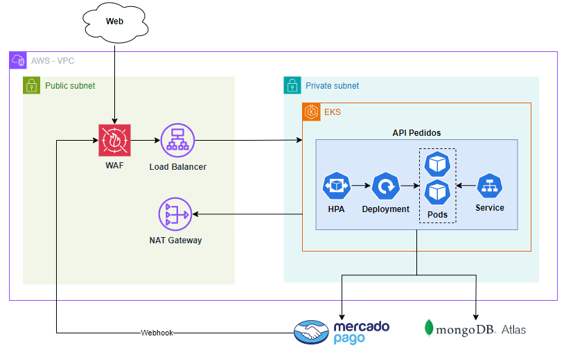

# Tech Chalange - Fiap - Software Architecture
## Problema
Há uma lanchonete de bairro que está expandindo devido seu grande sucesso. Porém, com a expansão e sem um sistema de controle de pedidos, o atendimento aos clientes pode ser caótico e confuso. Por exemplo, imagine que um cliente faça um pedido complexo, como um hambúrguer personalizado com ingredientes específicos, acompanhado de batatas fritas e uma bebida. O atendente pode anotar o pedido em um papel e entregá-lo à cozinha, mas não há garantia de que o pedido será preparado corretamente. Sem um sistema de controle de pedidos, pode haver confusão entre os atendentes e a cozinha, resultando em atrasos na preparação e entrega dos pedidos. Os pedidos podem ser perdidos, mal interpretados ou esquecidos, levando à insatisfação dos clientes e a perda de negócios. Em resumo, um sistema de controle de pedidos é essencial para garantir que a lanchonete possa atender os clientes de maneira eficiente, gerenciando seus pedidos e estoques de forma adequada. Sem ele, expandir a lanchonete pode acabar não dando certo, resultando em clientes insatisfeitos e impactando os negócios de forma negativa. Para solucionar o problema, a lanchonete irá investir em um sistema de autoatendimento de fast food, que é composto por uma série de dispositivos e interfaces que permitem aos clientes selecionar e fazer pedidos sem precisar interagir com um atendente.

# Entrega
1. Documentação do sistema (DDD) com Event Storming, incluindo todos os passos/tipos de diagrama mostrados na aula 6 do módulo de DDD, e utilizando a linguagem ubíqua, dos seguintes fluxos; poderá ser encontrado no link do Miro abaixo:
    - [Miro](https://miro.com/app/board/uXjVKaMIl9E=/?share_link_id=150094922925)
2. APIs podem ser analisada pelos endpoints; recomendado rodar e abrir pelo Swagger.
3. Dockerfile e compose estão na raiz do projeto.
4. Para o projeto utilizaremos o MongoDB e a API em C# e .NET.

## Iniciando o projeto

1. Faça o fork ou clone do projeto
2. Crie seu arquivo .env com as variáveis seguindo o mesmo esquema do .env.example
3. Pelo terminal entre na pasta, no mesmo nível do docker-compose.yml e rode o comando
```sh
docker compose up
```
4 - Acesse o localhost, de preferencia com a rota para o Swagger: http://localhost:5187/swagger

## Recomendação
1. Acesse o link abaixo para mais informações sobre a API.
- [Getting Started](https://7soat-g28.apidocumentation.com/guide/getting-started)
- [References](https://7soat-g28.apidocumentation.com/reference)

# Arquitetura da aplicação

# Iniciando a aplicação pelo Kubernetes
Para iniciar o projeto utilizando o Kubernetes, basta seguir os comandos encontrados abaixo:
- [Comandos](./k8s/comandos.md)
# Vídeo de apresentação do projeto fase 2:

# Participantes
- [Eric Silva](https://github.com/ericdss)
- [Felipe Augusto Lopes de Carvalho Magalhães](https://github.com/ALCM-bit)
- [Higor Hotz Vasconcelo](https://github.com/highotz)
- [Paulo Avelino Junior](https://github.com/PauloAvelino)
- [Victor Gustavo Duarte](https://github.com/victorg-duarte)
