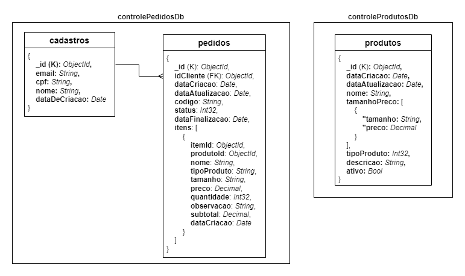

# Tech Chalange - Fiap - Software Architecture

# 1. Problema
Há uma lanchonete de bairro que está expandindo devido seu grande sucesso. Porém, com a expansão e sem um sistema de controle de pedidos, o atendimento aos clientes pode ser caótico e confuso. Por exemplo, imagine que um cliente faça um pedido complexo, como um hambúrguer personalizado com ingredientes específicos, acompanhado de batatas fritas e uma bebida. O atendente pode anotar o pedido em um papel e entregá-lo à cozinha, mas não há garantia de que o pedido será preparado corretamente. Sem um sistema de controle de pedidos, pode haver confusão entre os atendentes e a cozinha, resultando em atrasos na preparação e entrega dos pedidos. Os pedidos podem ser perdidos, mal interpretados ou esquecidos, levando à insatisfação dos clientes e a perda de negócios. Em resumo, um sistema de controle de pedidos é essencial para garantir que a lanchonete possa atender os clientes de maneira eficiente, gerenciando seus pedidos e estoques de forma adequada. Sem ele, expandir a lanchonete pode acabar não dando certo, resultando em clientes insatisfeitos e impactando os negócios de forma negativa. Para solucionar o problema, a lanchonete irá investir em um sistema de autoatendimento de fast food, que é composto por uma série de dispositivos e interfaces que permitem aos clientes selecionar e fazer pedidos sem precisar interagir com um atendente.

# 2. Solução

Para este projeto foi desenvolvido um monolito dividido inicialmente em 4 módulos: Clientes, Produtos, Pedidos, Checkout.

- Arquitetura: DDD + Clean Architecture
- Linguagem: C# (.NET)
- Banco de dados: MongoDB
- Cloud: AWS

## 2.1 Vídeo da apresentação do projeto
## [Link para o vídeo](https://youtu.be/BmOhPfFHHNM?si=_AlrYWsA-HPdZXII)

## 2.2 Event Storming

[Event Storming](https://miro.com/app/board/uXjVKaMIl9E=/?share_link_id=532142133626)

## 2.3 Arquitetura


## 2.4 Banco de Dados

Para este projeto utilizamos o MongoDB como banco de dados principal, sendo este um DB NoSQL que trabalha com documentos no formato JSON.

Como provedor, estamos utilizando o [Atlas](https://www.mongodb.com/pt-br/lp/cloud/atlas/try4), que fornece um MongoDB via cloud e totalmente gerenciado.

### 2.4.1 Modelagem

A seguir temos uma visão do modelo desenvolvido, que está dividido em dois bancos de dados:

- **controlePedidosDb**
    - <u>collections</u>: cadastros e pedidos
- **controleProdutosDb**
    -  <u>collections</u>: produtos



### 2.4.2 Justificativa

A escolha do MongoDB se deu devido ao seguintes fatores:

1. **Estrutura de Dados Flexível**:
Com o MongoDB, a lanchonete pode armazenar pedidos complexos, sem se preocupar com um esquema rígido de tabelas, como em bancos de dados SQL. A personalização de pedidos (ingredientes específicos, variações de acompanhamentos) pode ser registrada de forma flexível em documentos JSON, permitindo que cada pedido tenha sua própria estrutura única.

2. **Escalabilidade**:
A lanchonete está em expansão, o que significa que a demanda por pedidos pode aumentar rapidamente. O MongoDB é ideal para escalar horizontalmente, permitindo adicionar novos servidores conforme o volume de dados cresce. Isso garante que, mesmo em momentos de alta demanda, o sistema de autoatendimento possa continuar funcionando de forma eficiente, sem comprometer a performance.

3. **Alta Disponibilidade**:
O MongoDB suporta replicação de dados, o que significa que ele pode replicar os dados em vários servidores. Caso um servidor falhe, os dados ainda estarão disponíveis em outro, garantindo que o sistema de autoatendimento continue funcionando sem interrupções.

4. **Conhecimento da Equipe**:
MongoDB é extremamente popular e é utilizado em uma grande variedade de sistemas (principalmente e-commerces), possuindo uma boa documentação e suporte. Além disso, a curva de aprendizado é menos íngreme comparada a bancos de dados SQL tradicionais, especialmente para desenvolvedores que já trabalham com formatos como JSON, como no caso da nossa equipe.

5. **Modelo de Dados Simples**:
O sistema de pedidos de uma lanchonete pode ser relativamente simples em termos de requisitos de transação e relacionamento de dados. Os pedidos, por exemplo, podem ser armazenados como documentos com informações sobre os itens, o cliente, a forma de pagamento e o status do pedido. MongoDB é perfeito para armazenar esses dados de forma direta, sem a necessidade de joins complexos ou de transações envolvendo múltiplas tabelas.

# 3. Utilização

**Links Úteis**

- [Getting Started](https://7soat-g28.apidocumentation.com/guide/getting-started)
- [API Reference](https://7soat-g28.apidocumentation.com/reference)
- [Postman](https://www.postman.com/altimetry-astronomer-96690638/workspace/tech-challenge-7soat)

## 3.1 Rodar o projeto via Docker

1. Faça o fork ou clone do projeto

2. Crie seu arquivo .env com as variáveis seguindo o mesmo esquema do .env.example

3. Pelo terminal entre na pasta, no mesmo nível do docker-compose.yml e rode o comando
    ```sh
    docker compose up
    ```
4. Acesse a documentação das APIs via Swagger: http://localhost:5187/swagger

## 3.2 Ordem para utilização das APIs

1. Cadastre um usuário
    - [Exemplo](https://www.postman.com/altimetry-astronomer-96690638/workspace/tech-challenge-7soat/request/34581742-a7f6b507-031d-403d-8e0f-4567707c3ffb?action=share&source=copy-link&creator=35038815&ctx=documentation)
2. Adicione um ou mais produtos desejados
    - [Exemplo](https://www.postman.com/altimetry-astronomer-96690638/workspace/tech-challenge-7soat/request/34581742-3492eb73-ae67-40ce-ad57-8ddabcf41281?action=share&source=copy-link&creator=35038815&ctx=documentation)
3. Criar um pedido
    - [Exemplo](https://www.postman.com/altimetry-astronomer-96690638/workspace/tech-challenge-7soat/request/34581742-d5bca302-9ce8-49b6-beac-5e35805b4f6b?action=share&source=copy-link&creator=35038815&ctx=documentation)
4. Fazer o checkout do pedido
    - [Exemplo](https://www.postman.com/altimetry-astronomer-96690638/workspace/tech-challenge-7soat/request/34581742-21c832f5-c6f2-4647-b04c-82f39e2c2007?action=share&source=copy-link&creator=35038815&ctx=documentation)

> Uma vez que o processo de checkout completo depende do projeto estar rodando na internet com ao menos o webhook para callback do Mercado Pago, através da [API de Update](https://www.postman.com/altimetry-astronomer-96690638/workspace/tech-challenge-7soat/request/34581742-f3e3fd97-0e61-4870-aa0d-476028c40db6?action=share&source=copy-link&creator=34581742&ctx=documentation) é possível manipular o status dos pedidos conforme o necessário, facilitando os testes.

## 3.3 Rodar o projeto via Kubernetes

Para iniciar o projeto utilizando o Kubernetes, basta seguir os comandos encontrados abaixo:
- [Comandos](./k8s/comandos.md)

# 4. Participantes

- [Eric Silva](https://github.com/ericdss)
- [Felipe Augusto Lopes de Carvalho Magalhães](https://github.com/ALCM-bit)
- [Higor Hotz Vasconcelo](https://github.com/highotz)
- [Paulo Avelino Junior](https://github.com/PauloAvelino)
- [Victor Gustavo Duarte](https://github.com/victorg-duarte)